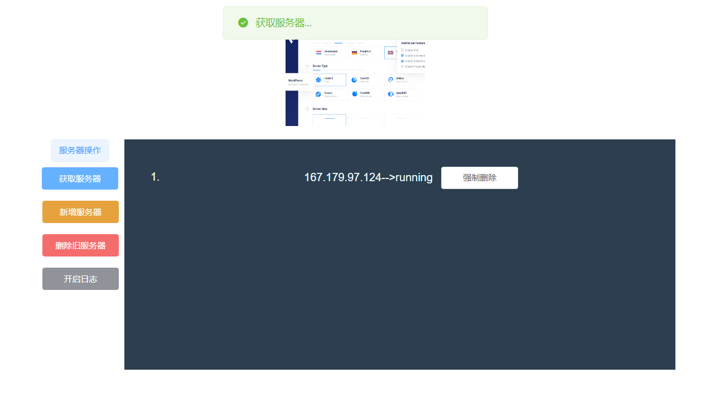

# IP Guard

## 项目介绍
> 基于springboot，对vultr api 进行调用  
> 本项目为后端源码（包含了编译过后的前端）；前端基于vue，  
> [查看前端源码: ip-guard-client](https://github.com/dbgee/ip-guard-client) 

## 环境配置
1. 开发工具:IDEA
2. maven 3.x

## 使用方式
1. 准备token 和快照id
    1. 申请Token ：[token 申请链接](https://my.vultr.com/settings/#settingsapi)
    2. 制作快照，获取 [snapshot_id](https://my.vultr.com/snapshots/)
2. 用申请到的token 、snapshot_id替换：[application.properties](src/main/resources/application.properties) 中的`vultr.token` 、`vultr.snapshot_id`的值
3. 编译、运行
    1. 克隆到本地 `git clone https://github.com/dbgee/ip-guard-server.git `
    2. 进入项目目录，打包编译 `mvn package`
    3. 运行 `java -jar target\ip-guard-v0.0.1.jar`
4. 访问服务器，默认端口8080

## 代码贡献
1. Fork [本项目](https://github.com/dbgee/ip-guard-server) 到自己的github 账号下
2. Clone 自己的项目代码到本地
3. 在本地修改代码（修复bug、新增功能）
4. push 到自己的项目代码下
5. PR (pull requests) 到本项目
    1. 贡献类型可以有很多，eg：readme 更新、readme 翻译、bug修改、功能优化、功能新增等等等等

## 运行示例

